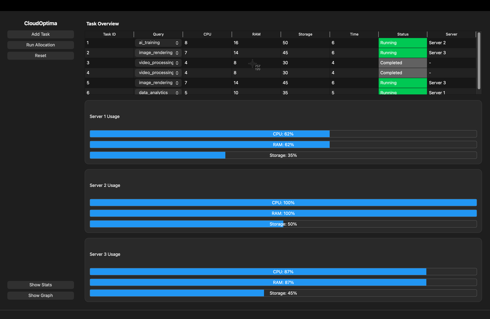
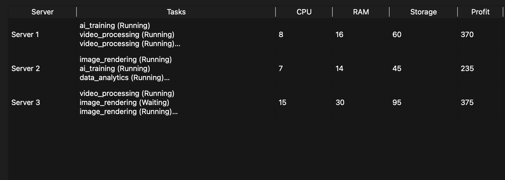
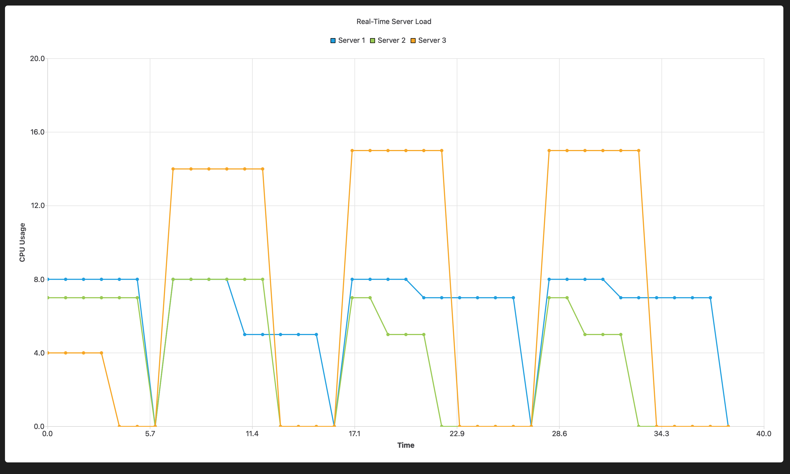

# 🚀 CloudOptima – Smart Resource Allocation Simulator

A **Qt-based desktop application** that simulates cloud resource allocation using multiple algorithmic strategies such as **Greedy, Priority Scheduling, and 2D Knapsack (Dynamic Programming)**.

---

## 📌 Project Overview

CloudOptima is designed to demonstrate how tasks can be efficiently allocated to servers under resource constraints (CPU, RAM, Storage).

It provides:

* 📊 Real-time simulation of task execution
* 📈 Live graph visualization
* 📋 Detailed statistics dashboard
* ⚙️ Hybrid algorithm-based allocation

---

## 🧠 Algorithms Used

### 🔹 1. Greedy Algorithm (Best-Fit)

* Assigns tasks to the server with minimum resource wastage
* Fast and efficient
* Used as fallback strategy

---

### 🔹 2. Priority Scheduling

* Tasks are sorted based on:

  ```
  priority = profit / (cpu + ram + storage)
  ```
* Ensures high-value tasks are processed first

---

### 🔹 3. 2D Knapsack (Dynamic Programming)

* Applied per server
* Maximizes total profit under CPU & RAM constraints
* Provides near-optimal allocation

---

### 🔹 4. Hybrid Approach

Final pipeline:

```
Priority Sorting → Knapsack Allocation → Greedy Fallback
```

---

## 🏗️ System Architecture

```
User Input (Tasks)
        ↓
Task Extraction
        ↓
Priority Sorting
        ↓
Knapsack Allocation (per server)
        ↓
Greedy Allocation (remaining tasks)
        ↓
Simulation Engine (QTimer)
        ↓
UI + Graph + Stats Update
```

---

## 💻 Features

* ✅ Add tasks using dropdown (profiles.txt)
* ✅ Real-time task execution simulation
* ✅ Server resource monitoring (CPU, RAM, Storage)
* ✅ Live graph visualization (Qt Charts)
* ✅ Statistics dashboard
* ✅ Task-to-server mapping
* ✅ Dark-theme compatible UI

---

## 📊 Screenshots

### 🔹 Main Interface



### 🔹 Statistics Dashboard



### 🔹 Real-Time Graph



---

## ⚙️ Technologies Used

* **C++**
* **Qt 6 (Qt Widgets + Qt Charts)**
* **CMake**
* **Data Structures & Algorithms**

---

## 📁 Project Structure

```
CloudOptima/
│
├── main.cpp
├── mainwindow.cpp / .h / .ui
├── statsdialog.cpp / .h / .ui
├── graphdialog.cpp / .h / .ui
├── profiles.txt
├── CMakeLists.txt
└── README.md
```

---

## ▶️ How to Run

### 🔧 Requirements

* Qt 6.5+
* CMake 3.19+
* C++ Compiler (GCC / Clang)

---

### 🛠️ Build Steps

```bash
git clone https://github.com/your-username/CloudOptima.git
cd CloudOptima
mkdir build
cd build
cmake ..
make
./CloudOptima
```

---

## 📈 Learning Outcomes

* Implementation of **Greedy & Dynamic Programming**
* Understanding of **resource allocation problems**
* Experience with **Qt GUI development**
* Real-time system simulation using **QTimer**
* Data visualization using **Qt Charts**

---

## 🎯 Future Enhancements

* 🔄 Algorithm comparison mode
* 📊 CPU/RAM/Storage toggle in graph
* ⚡ Load balancing using Min-Heap
* 🌐 Cloud deployment simulation

---

## ⭐ Conclusion

CloudOptima demonstrates how multiple algorithms can be combined to solve real-world resource allocation problems efficiently while providing a visual and interactive experience.

---

## 📎 License

This project is for educational purposes.

---
